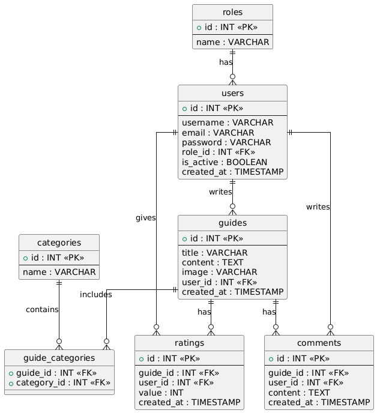

# AutoFix – platforma poradników napraw samochodowych

AutoFix to webowa aplikacja umożliwiająca przeglądanie, tworzenie oraz ocenianie poradników dotyczących napraw i konserwacji pojazdów.  
Projekt inspirowany jest serwisami typu iFixit i stanowi kompletną platformę społecznościową dla miłośników motoryzacji.

Aplikacja została wykonana w architekturze MVC z wyraźnym podziałem na backend (PHP + PostgreSQL) oraz frontend (HTML, CSS, JavaScript).

## Spis treści

- Funkcjonalność aplikacji
- Architektura
- Baza danych
- Diagram ERD
- Widoki aplikacji
- Frontend i design
- JavaScript i Fetch API
- Bezpieczeństwo
- Role użytkowników
- Technologie
- Instalacja
- Podsumowanie

## Funkcjonalność aplikacji

### Użytkownik niezalogowany
- przeglądanie poradników
- wyszukiwanie poradników
- filtrowanie po kategoriach
- podgląd ocen i komentarzy

### Użytkownik zalogowany
- dodawanie komentarzy
- usuwanie własnych komentarzy
- ocenianie poradników
- zarządzanie własnym profilem
- wylogowywanie

### Moderator
- dodawanie poradników
- edycja poradników
- usuwanie poradników
- moderowanie komentarzy

### Administrator
- panel administracyjny
- zarządzanie użytkownikami
- blokowanie / odblokowywanie kont
- usuwanie użytkowników
- zarządzanie rolami
- pełna kontrola nad systemem

## Architektura aplikacji

Projekt został zrealizowany w architekturze **MVC**.

### Struktura:

- **Routing** – centralny router (`index.php`)
- **Controllers** – logika aplikacji
  - AuthController
  - GuideController
  - CommentController
  - UserAdminController
- **Models** – obsługa bazy danych (PDO)
  - User
  - Guide
  - Comment
  - Category
  - Rating
- **Views** – warstwa prezentacji (HTML)
- **Helpers** – klasy pomocnicze (Auth, View)

Frontend i backend są logicznie rozdzielone.

## Baza danych (PostgreSQL)

Baza danych została zaprojektowana relacyjnie i zawiera m.in. tabele:

- `users`
- `roles`
- `guides`
- `categories`
- `guide_categories`
- `comments`
- `ratings`

Zastosowano:

- klucze główne i obce
- relacje 1:N oraz N:M
- akcje referencyjne (`ON DELETE CASCADE`)
- integralność danych

### Dodatkowe elementy bazy

- Widoki (VIEW) do agregacji danych
- Funkcje (FUNCTION) pomocnicze
- Transakcje przy zapisie poradników
- Klucze obce zabezpieczające spójność

### Diagram ERD

### Widok z adminera

## Widoki aplikacji

Poniżej znajdują się przykładowe widoki aplikacji.

### Strona główna

### Widok poradnika

### Edycja Poradnika

### Panel administracyjny

## Frontend i design

Frontend aplikacji został wykonany w technologii:

- HTML5
- CSS3
- JavaScript

Cechy interfejsu:

- spójna kolorystyka
- estetyczny layout
- responsywny grid
- skalowanie obrazów
- czytelna nawigacja
- dostosowanie do urządzeń mobilnych

## JavaScript i Fetch API

JavaScript wykorzystywany jest do:

- obsługi komentarzy (AJAX)
- oceniania poradników
- dynamicznego odświeżania danych
- obsługi edytora tekstu
- uploadu obrazów

Wykorzystano Fetch API do komunikacji z backendem:

- dodawanie komentarzy
- usuwanie komentarzy
- dodawanie ocen

## Bezpieczeństwo

Projekt zawiera podstawowe zabezpieczenia backendowe:

- SQL Injection - prepared statements (PDO)
- XSS - htmlspecialchars
- Hasła - password_hash (bcrypt)
- Sesje - PHP session
- Autoryzacja - kontrola ról
- Uprawnienia - backend validation
- Walidacja danych wejściowych
- Ograniczenie dostępu do panelu admina

Dodatkowo:

- użytkownik nie może usunąć własnego konta jako admin
- zawsze musi istnieć co najmniej jeden administrator

## Role użytkowników

W systemie występują cztery role:

Rola - Uprawnienia
Guest - Przeglądanie
User - Komentarze, oceny
Moderator - Zarządzanie poradnikami
Admin - Zarządzanie systemem

Uprawnienia są weryfikowane na podstawie sesji.

## Technologie

Projekt wykorzystuje:

- PHP 8+
- PostgreSQL
- Docker / Docker Compose
- HTML5 / CSS3
- JavaScript (Fetch API)
- CKEditor
- Adminer

## Podsumowanie

AutoFix jest kompletną aplikacją webową spełniającą wymagania projektu:

- architektura MVC
- obiektowy backend
- relacyjna baza danych
- obsługa ról
- panel administracyjny
- AJAX
- upload plików
- responsywny interfejs
- bezpieczeństwo
